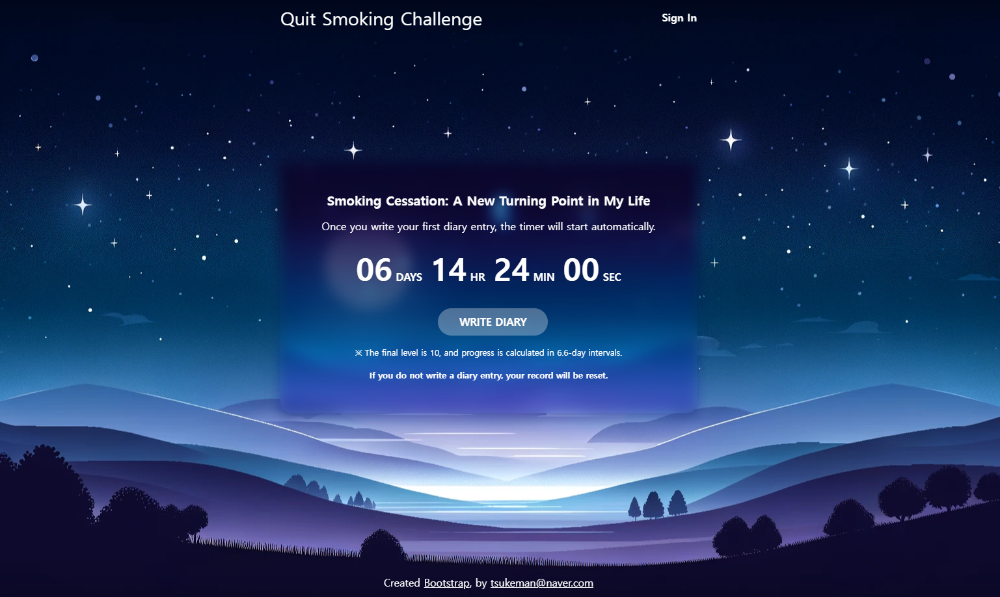
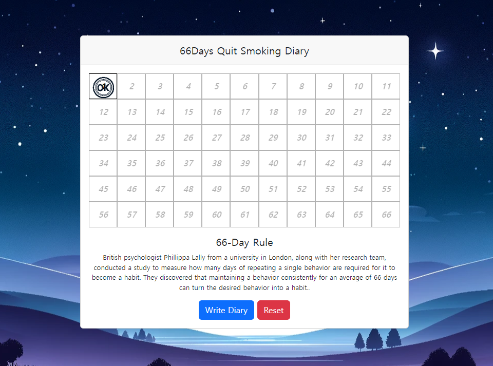
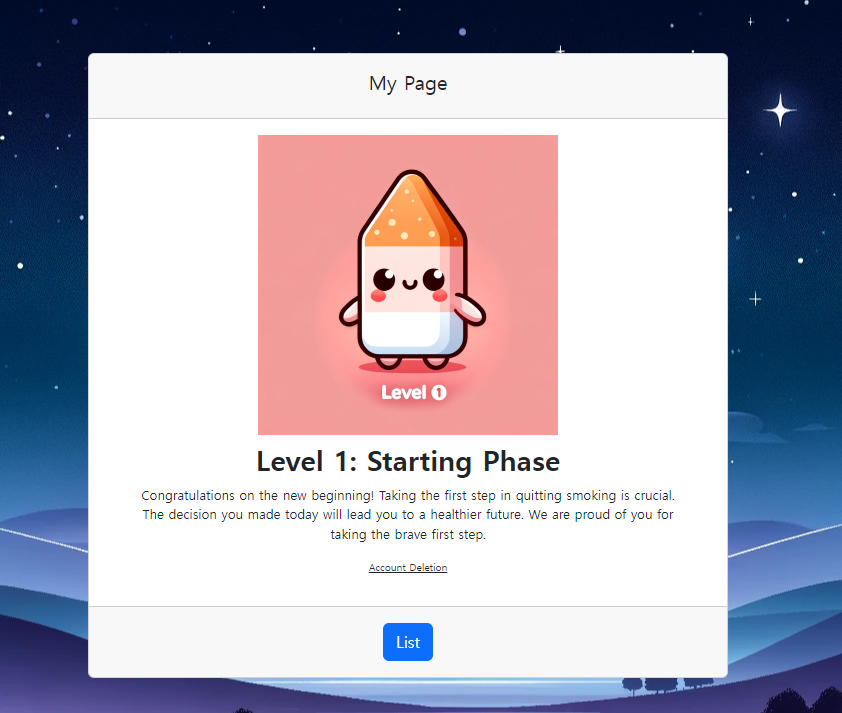

<h1 align="center">
  <br>
  <a href="http://www.amitmerchant.com/electron-markdownify"></a>
  <br>
  Smoking Diary
  <br>
</h1>


## Description

The optimal period for forming a habit is 66 days. Let's use these 66 days to build a smoking cessation habit by keeping a journal!

<a href="https://smokediary.imgdit.com">https://smokediary.imgdit.com</a>


<br>
 








## Getting Started

### Dependencies

* Describe any prerequisites, libraries, OS version, etc., needed before installing program.
* ex. Windows 10


### How To Run

To clone and run this application, you'll need [Git](https://git-scm.com) and [Java 11 or higher](https://docs.aws.amazon.com/corretto/latest/corretto-11-ug/downloads-list.html)

```bash
# Clone this repository
$ git clone https://github.com/tsukemandev/spring-smokediary.git

# Go into the repository
$ cd spring-smokediary

# Run used Gradle
$ ./gradlew bootRun

```


## Technology Stack

* Bootstrap (HTML, CSS)
* Javascript
* Java 11
* Database for H2 or MySql


